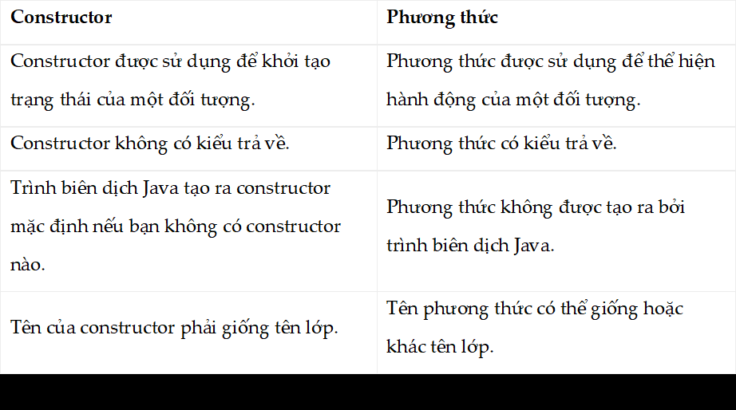

Lập trình hướng đối tượng trong java

1. Đối tượng (Object)
             
        - Đối tượng ở đây ta thể hiểu như khái niệm bên ngoài: Con người, Xe máy, Nhà cửa…
        - Trong một đối tượng sẽ bao gồm 2 thông tin: thuộc tính và phương thức.
          + Thuộc tính: là những thông tin của đối tượng. Ví dụ: con người có họ tên, chiều cao, độ tuổi,…
          + Phương thức: là những thao tác, hành động mà đối tượng đó có thể thực hiện. Ví dụ: con người có những hành động ăn, ngủ, đi lại,…
2. Lớp (Class)
   
        - Lớp chính là định nghĩa của đối tượng, ta sẽ xây dựng lớp để tạo ra những đối tượng khác nhau. 
        - Ví dụ như: Bạn Nguyễn Văn A và Nguyễn Văn B đều là con người, mà con người thì đều có tên, tuổi, chiều cao,.. tuy nhiên thông tin lại khác nhau.
        -> Như vậy con người chính là lớp, Nguyễn Văn A và Nguyễn Văn B là đối tượng.
3. Phương thức khởi tạo (Constructor)

        - Phương phức khởi tạo (Constructor) trong java là một dạng đặc biệt của phương thức dùng để khởi tạo các đối tượng
        - Khai báo của Constructor giống với khai báo của phương thức. Chỉ khác là nó phải có cùng tên với tên class và không có giá trị trả về
        - Có hai kiểu Constructor: 
          + Constructor mặc định: không có tham số truyền vào
          + Constructor tham số
      Sự khác nhau giữa Constructor và phương thức trong java

    
